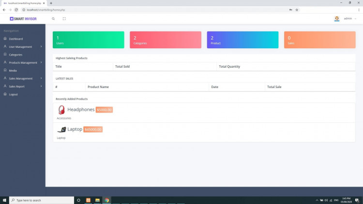

# Billing Management System in PHP/MySQLi

### Description
The Billing Management System was Developed in PHP MySQL. In this simple project, the main purpose of this project is to make a faster and reliable web application. At the initial stage of my study of PHP Programming Language, I prepare this system. 

### Features

<ul>
  <li><strong>Dashboard</strong></li>
  <li><strong>User Management</strong>
  <ul><li><strong>Manage Group</strong> (Add, edit, delete)</li>
  <li><strong>Manage Users</strong> (Add, edit, delete)</li>
  </ul></li>
  <li><strong>Categories</strong></li>
  <li><strong>Product Management</strong>
  <ul><li><strong>Manage Products</strong> (Add, edit, delete)</li>
  <li><strong>Add Products</strong></li>
  </ul></li>
  <li><strong>Media </strong>(Add, delete)</li>
  <li><strong>Sales Management</strong>
  <ul><li><strong>Manage sales</strong> (Add, edit, delete)</li>
  <li><strong>Add sale</strong></li>
  </ul></li>
  <li><strong>Sales Report</strong>
  <ul><li><strong>Sales by date</strong></li>
  <li><strong>Monthly sales</strong></li>
  <li><strong>Daily sales</strong></li>
  </ul></li>
  <li><strong>Logout</strong></li>
</ul>

Visit [sourcecodester.com](https://www.sourcecodester.com/php/14380/billing-management-system-php-mysql-updated.html) for more detailed information about this project.

### Website Info

| Title | Billing Management System in PHP/MySQLi with Source Code |
|:---|:---|
| Website | [www.sourcecodester.com](https://www.sourcecodester.com) |
| Link | https://www.sourcecodester.com/php/14380/billing-management-system-php-mysql-updated.html |
| Language | PHP |
| Developer/Uploader | [Nikhil_B](https://www.sourcecodester.com/users/nikhil-bhalerao) |
